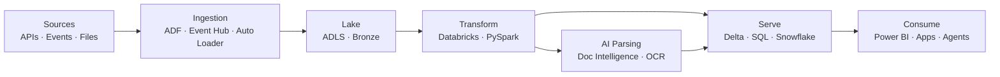

<div align="center">


**Lakehouse platforms · Real-time streaming · AI document intelligence · Analytics at scale**

<br/>

<a href="https://anandnerre.github.io/nerreanand.github.io/"></a>
<a href="https://www.linkedin.com/in/anandnerre/"></a>

<br/><br/>


</div>

---

### Senior Data Engineer · Bangalore, India · 9+ years in production data systems

I design and ship **cloud-native data platforms** that teams actually trust — high-throughput **PySpark** pipelines, **Databricks** lakehouses, **real-time streaming**, governed **Delta** layers, and **AI-powered document parsing** that turns PDFs, scans, and images into structured, review-ready data.

Previously delivered across **healthcare**, **adtech**, **food-tech**, and **banking** — from terabyte-scale ingestion to sub-second SQL and executive-ready **Power BI** products.

> **Open to senior remote roles, freelance platform work, and consulting.**  
> If it touches data volume, latency, quality, or unstructured documents — that's my lane.

<br/>

| **9+** | **25+** | **Real-time + Batch** | **Lakehouse-first** |
|:------:|:-------:|:---------------------:|:-------------------:|
| Years shipping data systems | Pipelines & platforms delivered | Event Hub · Structured Streaming · CDC | Databricks · Delta · Unity Catalog · Medallion |

---

## How I think about data platforms



**Principles I operate by:** observable pipelines, explicit data contracts, idempotent loads, performance by design, and human-in-the-loop where confidence matters.

---

## Core expertise

<table>
<tr>
<td width="33%" valign="top">

**Platform Engineering**

Azure ADF · ADLS Gen2 · Event Hub · Azure SQL · secure ingestion · orchestration · cost-aware storage design

</td>
<td width="33%" valign="top">

**Lakehouse & Spark**

Databricks jobs · Delta Lake · DLT · Unity Catalog · PySpark tuning · partitioning · streaming · reusable framework code

</td>
<td width="33%" valign="top">

**Analytics & AI Data**

Advanced SQL · Snowflake · Power BI semantic models · Document Intelligence · extraction workflows · review queues

</td>
</tr>
</table>

---

## Selected work

<table>
<tr>
<td width="50%">

### Multi-Format Document Parsing Pipeline
Ingest **PDFs, images, scans, and screenshots** (JPG, PNG, and more) — classify document type, extract structured fields with OCR/AI, validate confidence scores, and route exceptions to review before landing clean records in **Delta Lake**.

`Azure AI` · `FastAPI` · `Databricks` · `Delta` · `OCR`

</td>
<td width="50%">

### Healthcare Real-Time Pipeline
HL7/FHIR-style event streams across **Event Hub** topics with **PySpark Structured Streaming**, medallion quality layers, DLQ routing, and SLA monitoring.

`Event Hub` · `PySpark` · `Streaming` · `Delta`

</td>
</tr>
<tr>
<td width="50%">

### ServiceNow → Jira Migration
Wave-based migration of **47K+** historical tickets with validation gates, sensitive-data handling, and a Databricks transformation pipeline — zero data loss across a 10-month delivery.

`Databricks` · `Python` · `ETL` · `HIPAA-aware`

</td>
<td width="50%">

### Databricks CI/CD Framework
**Databricks Asset Bundles** + **GitHub Actions** for automated test/prod promotion with Azure Service Principals and **Unity Catalog** governance.

`DABs` · `GitHub Actions` · `Azure DevOps`

</td>
</tr>
<tr>
<td colspan="2">

### Snowflake Analytics Platform · Portfolio Analytics · SQL Performance
Curated warehouse models, clustering strategy, incremental loads, and Power BI layers — including tuned procedures and window patterns on **100M+** row datasets.

`Snowflake` · `SQL` · `Power BI` · `DAX`

</td>
</tr>
</table>

<a href="https://anandnerre.github.io/nerreanand.github.io/#projects"></a>

---

## Tech stack

<div align="center">

[](https://skillicons.dev/icons)

<br/>


</div>

---

## GitHub

<div align="center">


<br/>


</div>

---

## Industry experience

```
Healthcare   →  Terabyte-scale pipelines · Unity Catalog · streaming · governed lakehouse
Adtech       →  Real-time event processing · Azure streaming · high-volume ingestion
Food-tech    →  Snowflake warehouse · Power BI · ELT at scale · operational analytics
Banking      →  SQL reporting · migration support · reconciliation · data quality
```

---

## Let's build something reliable

I'm the engineer you call when the pipeline has to survive Monday morning — **correct data, clear lineage, and systems that scale without drama.**

**Strong fit for:** Azure lakehouse modernization · Databricks/PySpark optimization · real-time pipelines · AI document automation · SQL & warehouse performance · Power BI-ready data products

<div align="center">

<br/>

<a href="https://anandnerre.github.io/nerreanand.github.io/"></a>
<a href="https://www.linkedin.com/in/anandnerre/"></a>

<br/><br/>


</div>
